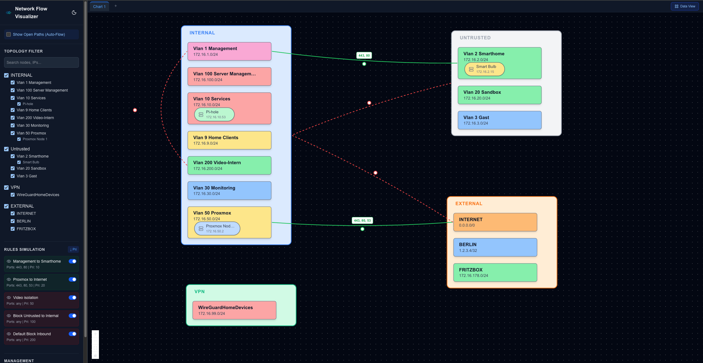
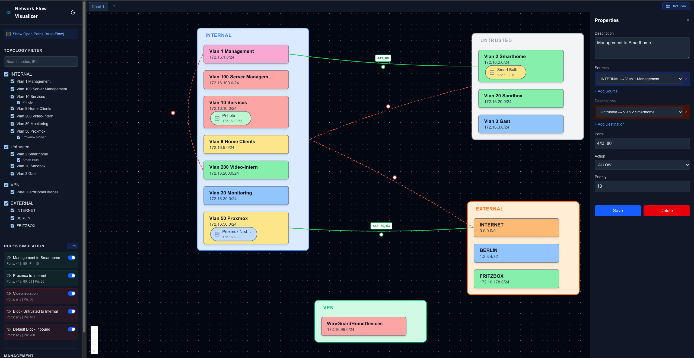
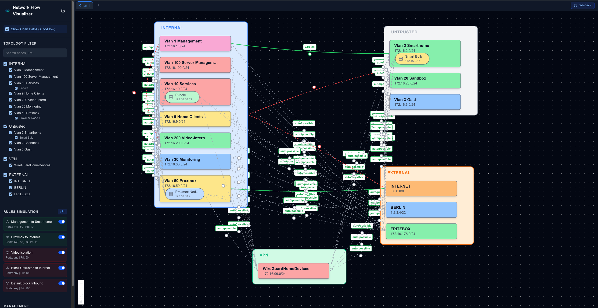
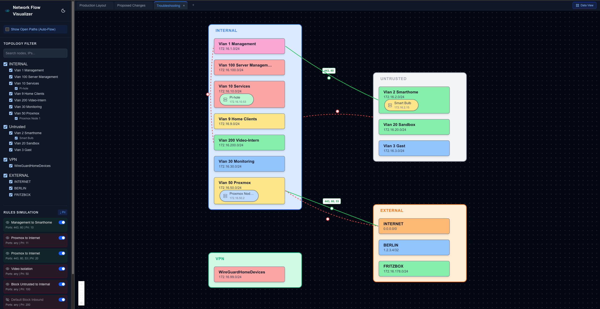
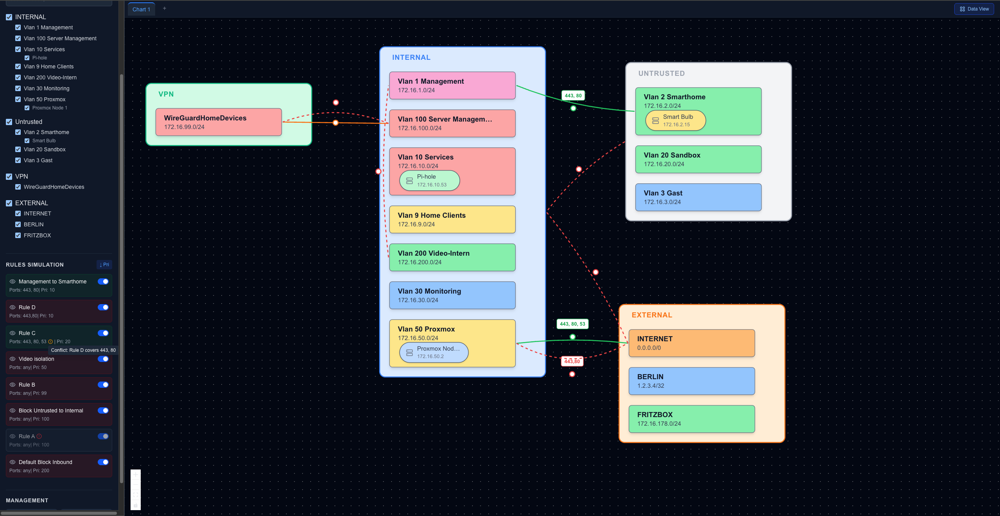

# Network Flow Visualizer - User Guide

This configuration and usage guide outlines all features within the Network Flow Visualizer, explaining what they do and how to use them to manage your simulated firewall topology gracefully.

---

## 1. The Main Dashboard Interface

When you first load the application, you'll see the main interface split into three distinct areas:
1. **The Sidebar (Left)**: Houses topology filtering, rule controls, visibility toggles, and main management buttons.
2. **The Chart View (Center/Right)**: This interactive graph is where all your Zones, Networks, Clients, and Rules are rendered.
3. **The Chart Tabs (Top)**: Quick navigation between multiple saved layouts or perspectives.

---

## 2. Managing Topology (Nodes)

Network Flow Visualizer allows for hierarchal structures: `Zones -> Networks -> Clients`.

### Adding Global Nodes
To add a new Zone, go to the bottom of the left sidebar and click **+ New Zone**. A new node will appear on your canvas.

### Adding Children (Networks and Clients)
Click on a Zone or Network in the graphical display. The **Properties Panel** will slide in from the right edge. Scroll to the bottom of this panel and click:
- `+ Add Network` if you clicked a Zone.
- `+ Add Client` if you clicked a Network.

### Drag & Drop Graph Interaction
Nodes are automatically organized vertically if they have relationships. However, you can click and drag the outer **Zone Nodes** to reposition them anywhere on your Canvas for custom organization. Your positions are automatically saved to your current Chart Tab.

---

## 3. The Properties Panel

Clicking on any element in the graph (a Node, an Edge line representing a rule, etc.) opens the Properties Panel.

**For Topology Nodes:**
- Edit the human-readable **Label**.
- Add descriptions or change color coordinates.
- For Networks: you can define the **CIDR** routing string and enable/disable **Client Isolation** (blocks intra-network flow routing).
- For Clients: you can assign specific IP addresses.

**For Rule Edges:**
- Modify **Action**: Allow / Block / Drop.
- Specify **Ports**: Provide comma-separated ports or leave as "any".
- Set **Priority**: A lower number dictates a higher priority (evaluates first).
- Modify **Source and Destination**: Easily reroute the rule without deleting it. You can select multiple sources and destinations for a single rule!

Don't forget to click the blue **Save** button when modifying properties!

---

## 4. Firewall Rule Management

Rules are the connective tissues of your architecture. 

### Adding a Rule
Click the **+ New Rule** button located at the bottom of the sidebar. This will instantly pop open the Properties Panel configured for a blank rule. Select your Source node, Destination node, define your protocol/port behavior, and hit Save. The graph will instantly draw an edge line matching your conditions.

### Simulating Rule Activation
Inside the left Sidebar beneath the "Rules Simulation" section, every rule is listed with its priority order.
- Click the **Checkbox Toggle Switch** next to a rule to instantly enable or disable it. The visual graph updates dynamically.
- Click the **Eye Icon** to completely hide the line from the graph, keeping it active in the backend but clearing graphical clutter.
- Click the **Sort Priority** button (↑ Pri / ↓ Pri) at the top of the rules list to change how the sidebar ranks rules.

---

## 5. The "Auto-Flow" Visualizer

Understanding what is essentially "open" in a massive network is difficult. **Auto-Flow** makes it easy.

At the top of the left sidebar, toggle **Show Open Paths (Auto-Flow)**.

When toggled on:
1. The tool calculates every valid path from every source to every destination node in real time.
2. It prioritizes the rules exactly how a real firewall appliance would.
3. If an explicit rule (e.g., `Priority 10: Deny All`) contradicts an open port, the tool evaluates it against priorities and stops the visualization precisely where the traffic drops.
4. Auto-Flow lines are heavily animated with dash-crawling visualizations, explicitly showing the direction of accepted traffic.

---

## 6. Chart Tabs and Persistent Views

At the very top of your workspace are the **Chart Tabs**. 

- Working on two separate concepts for an environment update? Click the **+** icon in the Chart Tabs list to deploy a completely fresh Canvas.
- Your toggled "hidden/visible" node parameters, rule toggles, Zone XY plane coordinates, and curved line dragging paths are saved independently to each Chart Tab.
- Double-click a Chart Tab to quickly rename it.

This enables you to maintain a "Production Layout", a "Proposed Changes" layout, and a "Troubleshooting" layout entirely in parallel.

---

## 7. Rule Conflict Visualization

The system automatically detects rules that negate or overlap with one another based on priority ordering.

- **Completely Shadowed Rules**: Rules that are entirely overridden by a higher-priority rule will turn grey. 
- **Partially Shadowed Rules**: Rules that are partially overridden (for example, specific ports are blocked by a higher rule, but other ports are allowed) will display a yellow warning `!` icon.
- **Tooltip Inspector**: Hover your mouse over the warning icon to see exactly which higher-priority rule is causing the conflict.

---

## 8. Exporting the Topology

You can export your current network architecture and rule set at any time. Look for the **Export** menu in the top right corner next to your Chart Tabs. 
- **Export to SVG**: Downloads a high-resolution, scalable vector graphics file of your exact canvas view.
- **Export to CSV / XLSX**: Downloads structured spreadsheet lists of all Nodes and Rules across your environment for auditing.
